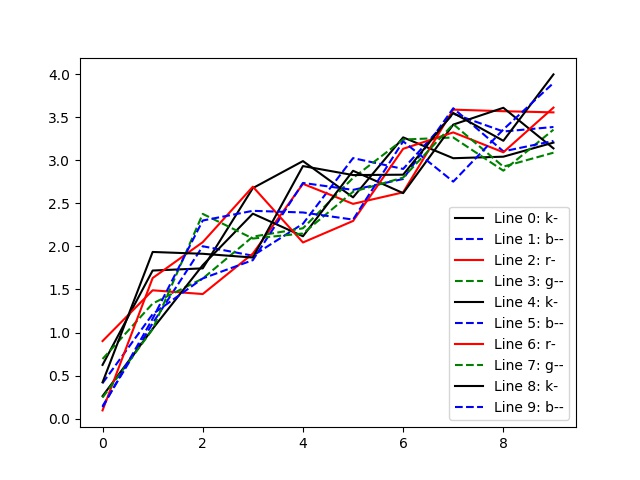

# 10 powerful built-in functions from the Python standard library


*Photo by Divide By Zero on Unsplash*

There are a ton of awesome packages available in the Python ecosystem, but sometimes all you need is a built-in function. It might not be as glamorous without the branding of an exciting new package, but you can go a long way with the standard library. If nothing else, learning about the following Python built-ins could help you speed up your development and improve code readability.

> Note: this tutorial written for Python 3.7+

## Globally available functions

### #1 - **enumerate**

The `enumerate` function is handy when you want to keep track of an index as you loop through an iterable. This can remove counter variables you might have been using if coming to Python from another language.

```python
abcs = list('ABCDEF')

# Without enumerate
k = 0
for letter in abcs:
    print(k, letter.lower())  # => 0 a, 1 b ...
    k += 1

# With enumerate
for k, letter in enumerate(abcs): 
    print(k, letter.lower())  # => 0 a, 1 b ...
```

The way `enumerate` works is by returning an enumerate object with a `__next__` method that returns a tuple of `(count, value)`. You can even use destructuring to enumerate more complex values.

```python
abcs = [('a', 'A'), ('b', 'B'), ('c', 'C')]

for k, (lower, upper) in enumerate(abcs):
    print(k, lower, upper)  # => 0 a A, 1 b B ...
```

### #2 -  **zip**

The `zip` function is useful when you want to combine multiple iterables together. A common use-case is to loop over two lists simultaneously without direct indexing.

```python
ABCs = list('ABCDEF')
abcs = list('abcdef')

# Without zip
for upper in ABCs:
    idx = ABCs.index(upper)
    print(upper, abcs[idx])  # => A a, B b ...

# With zip
for upper, lower in zip(ABCs, abcs):
    print(upper, lower)  # => A a, B b ...
```

Removing the manual indexing makes the code easier to understand because it removes a step of thinking about what the index corresponds to. If you're feeling fancy, you can combine `enumerate` with `zip` because `enumerate` doesn't care what kind of iterable it recieves.

```python
for k, (upper, lower) in enumerate(zip(ABCs, abcs)):
    print(k, upper, lower)  # => 0 A a, 1 B b ...
```

### #3 - **map**

The `map` function is powerful in its generality, and understanding it can help you speed up computations with `multiprocessing`. Conceptually, `map` applies a given function to each element in an iterable and returns the results in order. We can use `lambda` to quickly create the function `f(x) = abs(x ** 2 - 4 * x)` and map it over some values of `x`.

```python
func = lambda x: abs(x ** 2 - 4 * x)
xs = range(10)

# Without map
results = [func(x) for x in xs]
print(results)  # => [0, 3, 4, 3, ...]

# With map
results = list(map(func, xs))
print(results)  # => [0, 3, 4, 3, ...]
```

With `map`, it's clear that we are trying to apply `func` to all `xs` but without specifing exactly how to do it. For example, if `xs` were a large vector, we could speed up this computation using the analogous `map` method on a `multiprocessing.Pool` object.

```python
from multiprocessing import Pool, cpu_count

def func(x): 
    return abs(x ** 2 - 4 * x)

xs = range(1_000_000)
with Pool(cpu_count()) as pool:
    results = pool.map(func, xs)
print(len(results))  # => 1000000
```

Notice we are using the `with` keyword to create a context for managing resouces for the processing pool. The `cpu_count` function will return the number of cores available on the machine, and `pool.map` will apply `func` to items in `xs` in parallel. This demonstrates that `map` also provides a useful syntax for expressing a single program, multiple data (SPMD)-style computation.

### #4 - **dir**

The `dir` function is helpful to perform introspection on Python objects (to see what attributes they have). For example, we can use `dir` to see what's defined in the `os` module.

```python
import os
print(dir(os))  # => ['CLD_CONTINUED', 'CLD_DUMPED', ...]
```

We can also use `dir` to observe the *special methods* that underlie the Python data model.

```python
print(dir(list('ABCDEF')))  # => ['__add__', '__class__', ...]
```

Not only can we see methods like `append` and `sort` on our list, but we can also see the `__iter__` method, which returns an iterator object when involked.

## The string module

### #5 - **string.ascii_uppercase**

The `string` module contains useful constants that can save you some typing. For example, if you ever need all the letters of the English alphabet, you can use `string.ascii_lowercase` or `string.ascii_uppercase`.

```python
import string
print(string.ascii_lowercase)
print(string.ascii_uppercase)
```

Personally, I have used `string.ascii_uppercase` when working with 384-well plates that have well names from "A1" to "P24"

## The itertools module

As the name suggests, the `itertools` module contains utilities for working with iterables. These iterator building-blocks not only provide memory efficiency through lazy execution, but they also provide a clean syntax for several common transformations.

### #6 - **itertools.cycle**

The `itertools.cycle` function takes an iterable and returns an iterator that will endlessly loop through the original input values.

```python
import numpy as np
import matplotlib.pyplot as plt
from itertools import cycle

n_lines = 10
n_pts = 10
styles = [ 'k-', 'b--', 'r-', 'g--' ]

plt.figure()
for k, style in zip(range(n_lines), cycle(styles)):
    x = np.arange(n_pts)
    y = np.sqrt(x) + np.random.rand(n_pts)
    plt.plot(x, y, style, label=f'Line {k}: {style}')
plt.legend()
plt.show()
```



As you can see, this can be useful for cycling through plotting styles where it's cumbersome to specify a ton of styles and okay to repeat some. Notice that `cycle` was used inside `zip`, so the cycled styles iterator didn't exhaust even though `len(styles) < n_lines`.

### #7 - **itertools.product**

The `itertools.product` function returns the Cartesian product of the input iterables, which is just a fancy way of saying it makes a grid.

```python
import string
from itertools import product

row_names = string.ascii_uppercase[:16]
col_names = range(1, 25)

wells = list(product(row_names, col_names))
print(wells)  # => [('A', 1), ('A', 2), ...]
```

Here, we get a list of 384 tuples (16 rows * 24 columns) that cycle like an odometer through the input iterables.

## The functools module

The `functools` module contains functions that act on other functions. You can find lots of great functional programming utilities here.

### #8 - **functools.partial**

The `functools.partial` function allows us to *Curry* a function, which means to specify certain arguments as fixed values ahead of time. Currying a function returns a new function that takes fewer arguments.

```python
from functools import partial

# f takes 2 arguments
def f(x, y):
    return abs(x ** 2 - 4 * y)

# g takes 1 argument
g = partial(f, y=0)

print(g(4))  # => 16
```

This will print `16` because `g(x) = f(x, y=0) = abs(x ** 2)`. This is particularly useful when working with higher-order functions that assume a certain signature for an input function (ie. using `pool.map` for multiprocessing)

## Useful IO modules

Including these built-in modules might be cheating since they are not functions themselves. However, they provide simple interfaces for reading and writing different types of data, so it seems more logical to consider these functions together.

### #9 - **json**

The `json` module provides a built-in interface for reading and writing JSON data.

```python
import json

data = {
    'name': 'Bia',
    'color': 'Black',
    'breed': 'Labrador mix'
}

with open('data.json', 'w') as fd:
    json.dump(data, fd)  # => data.json JSON file created

with open('data.json', 'r') as fd:
    data_json = json.load(fd)

print(data_json)  # => {'name': 'Bia', ...}
```

This is particularly useful when dealing with data from the web, doing your own scraping, or working with other languages that work well with JSON.

### #10 - **pickle**

The `pickle` module provides a built-in interface for reading and writing pickled objects. *Pickling* is the process of serializing Python objects into a flat, binary structure that can be written to disk. The `pickle` module is useful, therefore, to save an object in its current state for later use.

```python
import pickle

model = {
    'method': 'logistic',
    'weights': [-0.34, 0.45, 0.72, -1.21]
}

with open('model.pkl', 'wb') as fd:
    pickle.dump(model, fd, pickle.HIGHEST_PROTOCOL)  # => model.pkl created

with open('model.pkl', 'rb') as fd:
    model_pkl = pickle.load(fd)

print(model_pkl)  # => {'method': 'logistic', ...}
```

This use-case is common in machine learning applications where models are Python objects and weights are internal state that must be saved.

## Final thoughts

The functions discussed here are just a few examples of the awesome built-in functions available in Python. Next time you find yourself trying to figure out how to write something in a clear and concise way, give the [Standard Library](https://docs.python.org/3/library/index.html) some thought. It has helped me many times, and I hope it can help you too.
