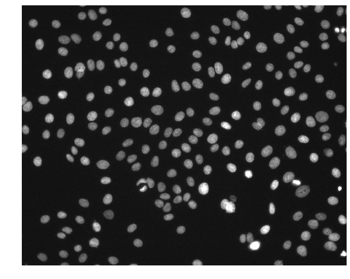

# Speeding up scientific computing with multiprocessing in Python


*Photo by Christian Wiediger on Unsplash*

In this tutorial, we will look at how we can speed up scientific computations using `multiprocessing` in a real-world example. Specifically, we will detect the location of all nuclei within fluorescence microscopy images from the public [MCF7 Cell Painting dataset](https://bbbc.broadinstitute.org/BBBC021) released by the Broad Institute.

After completing this tutorial, you will know how to do the following:

- Detect nuclei in fluorescence microscopy images
- Speed up image processing using `multiprocessing.Pool`
- Reduce serialization overhead using copy-on-write (Unix only)
- Add a progress bar to parallel processing tasks

## Download the dataset

> Note: The imaging data is nearly 1 GB for just one plate. You will need a few GB of space to complete this tutorial.

First, download the imaging data for the first plate of the Cell Painting dataset [here](https://data.broadinstitute.org/bbbc/BBBC021/BBBC021_v1_images_Week1_22123.zip) to a folder called `images/` and extract it. You should get a folder called `images/Week1_22123/` filled with TIFF images. The images are named according to the following convention:

```
# Template
{week}_{plate}_{well}_{field}_{channel}{id}.tif

# Example
Week1_150607_B02_s4_w1EB868A72-19FC-46BB-BDFA-66B8966A817C.tif
```

## Find all DAPI images

DAPI is a fluorescent dye that binds to DNA and will stain the nuclei in each image. Typically, DAPI signal will be captured in the first channel of the microscope. We'll first need to parse the image names to find images from the first channel (`w1`) so that we can detect the nuclei from only the DAPI images.

```python
from glob import glob

paths = glob('images/Week1_22123/Week1_*_w1*.tif')
paths.sort()
print(len(paths))  # => 240
```

Here, we used `glob` and a pattern with wildcards to find the paths to all DAPI images. Apparently there are 240 DAPI images that we need to process! We can load the first image to see what we are working with.

```python
from skimage import io
import matplotlib.pyplot as plt

img = io.imread(paths[0])
print(img.shape, img.dtype, img.min(), img.max())
# => (1024, 1280) uint16 176 10016

plt.figure(figsize=(6, 6))
plt.imshow(img, cmap='gray', vmax=4000)
plt.axis('off')
plt.show()
```



We can see that the images are (1024, 1280) arrays of 16-bit unsigned integers. This particular image has pixel intensities ranging from 176 to 10,016.

## Using `skimage` to detect nuclei

Scikit-image is a Python package for image processing that we can use to detect nuclei in these DAPI images. A simple and effective approach is to smooth the image to reduce noise and then find all local maxima that are above a given intensity threshold. Let's write a function to do this on our example image.

```python
from skimage.filters import gaussian
from skimage.feature import peak_local_max

def detect_nuclei(img, sigma=4, min_distance=6, threshold_abs=1000):
    g = gaussian(img, sigma, preserve_range=True)
    return peak_local_max(g, min_distance, threshold_abs)

centers = detect_nuclei(img)
print(centers.shape)  # => (214, 2)

plt.figure(figsize=(6, 6))
plt.imshow(img, cmap='gray', vmax=4000)
plt.plot(centers[:, 1], centers[:, 0], 'r.')
plt.axis('off')
plt.show()
```


Now we're getting somewhere! The `detect_nuclei` function takes in an `img` array and returns an array of nuclei (x, y)-coordinates called `centers`. It first smooths the `img` array by applying a `gaussian` blur with `sigma = 4`. The `preserve_range = True` argument prevents `skimage` from normalizing the image so that we get back a smoothed image `g` in the same intensity range as the input. Then, we use the `peak_local_max` function to detect all local maxima in our smoothed image. We set `min_distance = 4` to prevent any two nuclei centers from being unrealistically close together and `threshold_abs = 1000` to avoid detecting false positives in dark regions of the image.

> Note: We will use this `detect_nuclei` function in all subsequent experiments.

## Method 1 - List comprehension with IO

Now that we have a function to detect nuclei coordinates, let's apply this function to all of our DAPI images using a simple list comprehension.

```python
from tqdm.notebook import tqdm

def process_images1(paths):
    return [detect_nuclei(io.imread(p)) for p in paths]

meth1_times = %timeit -n 4 -r 1 -o centers = process_images1(tqdm(paths))
# => 18 s ± 0 ns per loop (mean ± std. dev. of 1 run, 4 loops each)
```

In `process_images1`, we take in a list of image paths and use a list comprehension to load each image and detect nuclei. Using the `%timeit` magic command in Jupyter, we can see that this approach has an average execution time of ~18 seconds. 

## Method 2 - multiprocessing.Pool with IO

Let's see if we can speed things up with a processing `Pool`. To do this, we need to define a function to wrap `detect_nuclei` and `io.imread` together so that we can `map` that function over the list of image paths.

```python
import multiprocessing as mp

def _process_image(path):
    return detect_nuclei(io.imread(path))

def process_images2(paths):
    with mp.Pool() as pool:
        return pool.map(_process_image, paths)

meth2_times = %timeit -n 4 -r 1 -o centers = process_images2(paths)
# => 5.54 s ± 0 ns per loop (mean ± std. dev. of 1 run, 4 loops each)
```

Much better. This was run on a machine with `cpu_count() == 8`. Now the same task has an average execution time of ~5.5 seconds (>3x speed up).

## Method 3 - List comprehension from memory

What would happen if we read all the images into memory before detecting nuclei? Presumably, this approach would be faster because we wouldn't have to read the image data from disk during the `%timeit` command. Let's try it.

```python
import numpy as np

images = np.asarray([io.imread(p) for p in tqdm(paths)])

def process_images3(images):
    return [detect_nuclei(img) for img in images]

meth3_times = %timeit -n 4 -r 1 -o centers = process_images3(tqdm(images))
# => 17.7 s ± 0 ns per loop (mean ± std. dev. of 1 run, 4 loops each)
```

Now the list comprehension is slightly faster, but only by about 0.3 seconds. This suggests that reading image data is not the rate-limiting step in Method 1, but rather the `detect_nuclei` computations.

## Method 4 - multiprocessing.Pool from memory

Just for completeness, let's try using `multiprocessing.Pool` to `map` our `detect_nuclei` function over all the images in memory.

```python
def process_images4(images):
    with mp.Pool() as pool:
        return pool.map(detect_nuclei, images)

meth4_times = %timeit -n 4 -r 1 -o centers = process_images4(images)
# => 6.23 s ± 0 ns per loop (mean ± std. dev. of 1 run, 4 loops each)
```

Wait, what? Why is this *slower* than also reading the images from disk with `multiprocessing`? If you read the documentation for the `multiprocessing` module closely, you will learn that data passed to workers of a `Pool` must be serialized via `pickle`. This serialization step creates some computational overhead. That means for Method 2, we were pickling path strings, but in this case, we were pickling entire images.

## Method 5 - multiprocessing.Pool with serialization fix

Fortunately, there are several ways to avoid this serialization overhead when using `multiprocessing`. On Mac and Linux systems, we can take advantage of how the operating system handles process forks to efficiently process large arrays in memory (sorry Windows 🤷‍♂️). Unix-based systems use *copy-on-write* behavior for forked processes. Loosely, copy-on-write means the forked process will only copy data when attempting to modify the shared virtual memory. This all happens behind the scenes, and copy-on-write is sometimes referred to as *implicit sharing*.

```python
def _process_image_memory_fix(i):
    global images
    return detect_nuclei(images[i])

def process_images5(n):
    with mp.Pool() as pool:
        return pool.map(_process_image_memory_fix, range(n))

meth5_times = %timeit -n 4 -r 1 -o centers = process_images5(len(paths))
# => 5.31 s ± 0 ns per loop (mean ± std. dev. of 1 run, 4 loops each)
```

Nice! This is now slightly faster than Method 2 (as we may have originally expected). Notice that we use a `global` statement here to explicitly declare that this function uses the `images` array defined globally. While this is not strictly required, I have found it helpful to indicate that the `_process_image_memory_fix` function depends on some `images` array being available. We then `map` over all indices and allow each process to access the image it needs by indexing into the `images` array. This approach will only pickle integers instead of the images themselves.

## Results

Let's compare the average execution times of all 5 methods.


Overall, `multiprocessing` drastically reduced the average execution times for this nuclei detection task. Interestingly, a naive approach to multiprocessing with images in memory actually increased the average execution time. By taking advantage of copy-on-write behavior, we were able to remove the significant serialization overhead of incurred when pickling whole images.

To show off more of our results, let's show a random sample of 16 DAPI images sorted by the number of detected nuclei in each image.


It appears that our simple nuclei detection strategy was effective and has allowed us to organize the DAPI images according to the observed cell density in each field of view.

## Conclusion


*From Spaceballs the movie*

I really hope this article was helpful, so please let me know if you enjoyed it. The `multiprocessing` techniques presented here have helped me achieve ridiculous speed when processing images for our [SCOUT paper](https://www.nature.com/articles/s41598-020-78130-7). Perhaps in a future we can revisit this example but with GPU acceleration to finally achieve *ludicrous speed*.

## Bonus: Using progress bars with multiprocessing.Pool

In the above `multiprocessing` examples, we do not have a nice `tqdm` progress bar. We can get one if we use `pool.imap` instead, which is useful for long-running computations.

```python
def _process_image(path):
    return detect_nuclei(io.imread(path))

def process_images_progress(paths):
    with mp.Pool() as pool:
        return list(tqdm(pool.imap(_process_image, paths), total=len(paths)))

centers = process_images_progress(paths)
```

## References

We used image set [BBBC021v1](https://bbbc.broadinstitute.org/bbbc/BBBC021) [[Caie et al., Molecular Cancer Therapeutics, 2010](http://dx.doi.org/10.1158/1535-7163.MCT-09-1148)], available from the Broad Bioimage Benchmark Collection [[Ljosa et al., Nature Methods, 2012](http://dx.doi.org/10.1038/nmeth.2083)].

## Source Availability

All source materials for this article are available [here](https://github.com/jmswaney/blog/tree/main/02_multiprocessing_tips) on my blog GitHub repo.
