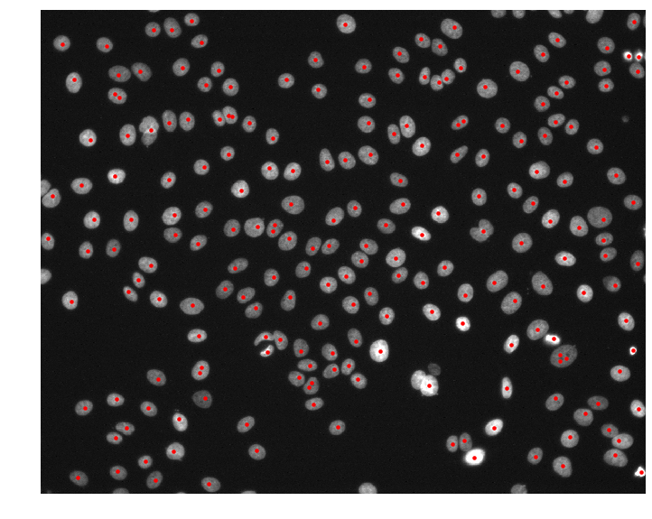
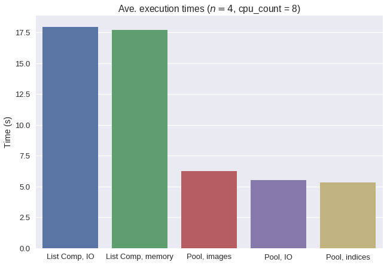

# Speeding up computations in Python with multiprocessing


*Photo by Christian Wiediger on Unsplash*

In this tutorial, we will look at how we can speed up scientific computations using `multiprocessing` in a real-world example. Specifically, we will detect the location of all nuclei within fluorescence microscopy images from the public [MCF7 Cell Painting dataset](https://bbbc.broadinstitute.org/BBBC021) released by the Broad Institute.

After completing this tutorial, you will know how to do the following:

- Detect nuclei in fluorescence microscopy images
- Speed up image processing using `multiprocessing.Pool`
- Add a progress bar to parallel processing tasks
- Reduce serialization overhead using copy-on-write (Unix only)

## Download the dataset

> Note: The imaging data is nearly 1 GB for just one plate. You will need a few GB of space to complete this tutorial.

First, download the imaging data for the first plate of the Cell Painting dataset [here](https://data.broadinstitute.org/bbbc/BBBC021/BBBC021_v1_images_Week1_22123.zip) to a folder called `images/` and extract it. You should get a folder called `images/Week1_22123/` filled with TIFF images. The images are named according to the following convention:

```
# Template
{week}_{plate}_{well}_{field}_{channel}{id}.tif

# Example
Week1_150607_B02_s4_w1EB868A72-19FC-46BB-BDFA-66B8966A817C.tif
```

## Find all DAPI images

DAPI is a fluorescent dye that binds to DNA and will stain the nuclei in each image. Typically, DAPI signal will be captured in the first channel of the microscope. We'll first need to parse the image names to find `w1` channel images so that we can detect the nuclei from only the DAPI images.

```python
from glob import glob

paths = glob('images/Week1_22123/Week1_*_w1*.tif')
paths.sort()
print(len(paths))  # => 240
```

Here, we used `glob` and a pattern with wildcards to find the paths to all DAPI images. Apparently there are 240 DAPI images that we need to process! We can load the first images to see what we are working with.

```python
from skimage import io
import matplotlib.pyplot as plt

img = io.imread(paths[0])
print(img.shape, img.dtype, img.min(), img.max())
# => (1024, 1280) uint16 176 10016

plt.figure(figsize=(6, 6))
plt.imshow(img, cmap='gray', vmax=4000)
plt.axis('off')
plt.show()
```


## Using `skimage` to detect nuclei

Scikit-image is a Python package for image processing that we can use to detect nuclei in DAPI images. A simple and effective approach is to smooth the image to reduce noise, and then find all local maxima in the intensity that are above a given threshold. Let's write a function to do this on our example image.

```python
from skimage.filters import gaussian
from skimage.feature import peak_local_max

def detect_nuclei(img, sigma=4, min_distance=6, threshold_abs=1000):
    g = gaussian(img, sigma, preserve_range=True)
    return peak_local_max(g, min_distance, threshold_abs)

centers = detect_nuclei(img)
print(centers.shape)  # => (214, 2)

plt.figure(figsize=(6, 6))
plt.imshow(img, cmap='gray', vmax=4000)
plt.plot(centers[:, 1], centers[:, 0], 'r.')
plt.axis('off')
plt.show()
```



## Method 1 - List comprehension from disk

Now that we have a function to detect nuclei coordinates, let's apply this function to all of our DAPI images using a simple list comprehension.

```python
from tqdm.notebook import tqdm

def process_images1(paths):
    return [detect_nuclei(io.imread(p)) for p in paths]

meth1_times = %timeit -n 4 -r 1 -o centers = process_images1(tqdm(paths))
# => 18 s ± 0 ns per loop (mean ± std. dev. of 1 run, 4 loops each)
```

## Method 2 - multiprocessing.Pool

```python
import multiprocessing as mp

def _process_image(path):
    return detect_nuclei(io.imread(path))

def process_images2(paths):
    with mp.Pool() as pool:
        return pool.map(_process_image, paths)

meth2_times = %timeit -n 4 -r 1 -o centers = process_images2(paths)
# => 5.54 s ± 0 ns per loop (mean ± std. dev. of 1 run, 4 loops each)
```

## Method 3 - List comprehension from memory

```python
def process_images3(images):
    return [detect_nuclei(img) for img in images]

meth3_times = %timeit -n 4 -r 1 -o centers = process_images3(tqdm(images))
# => 17.7 s ± 0 ns per loop (mean ± std. dev. of 1 run, 4 loops each)
```

## Method 4 - multiprocessing.Pool from memory

```python
def _process_image_memory(img):
    return detect_nuclei(img)

def process_images4(images):
    with mp.Pool() as pool:
        return pool.map(_process_image_memory, images)

meth4_times = %timeit -n 4 -r 1 -o centers = process_images4(images)
# => 5.9 s ± 0 ns per loop (mean ± std. dev. of 1 run, 4 loops each)
```

## Method 5 - multiprocessing.Pool with serialization fix

```python
def _process_image_memory_fix(i):
    global images
    return detect_nuclei(images[i])

def process_images5(n):
    with mp.Pool() as pool:
        return pool.map(_process_image_memory_fix, range(n))

meth5_times = %timeit -n 4 -r 1 -o centers = process_images5(len(paths))
# => 5.31 s ± 0 ns per loop (mean ± std. dev. of 1 run, 4 loops each)
```

## Results



## Bonus: Using progress bars with multiprocessing.Pool

```python
def _process_image(path):
    return detect_nuclei(io.imread(path))

def process_images_progress(paths):
    with mp.Pool() as pool:
        return list(tqdm(pool.imap(_process_image, paths), total=len(paths)))

centers = process_images_progress(paths)
```

## References

We used image set [BBBC021v1](https://bbbc.broadinstitute.org/bbbc/BBBC021) [[Caie et al., Molecular Cancer Therapeutics, 2010](http://dx.doi.org/10.1158/1535-7163.MCT-09-1148)], available from the Broad Bioimage Benchmark Collection [[Ljosa et al., Nature Methods, 2012](http://dx.doi.org/10.1038/nmeth.2083)].
