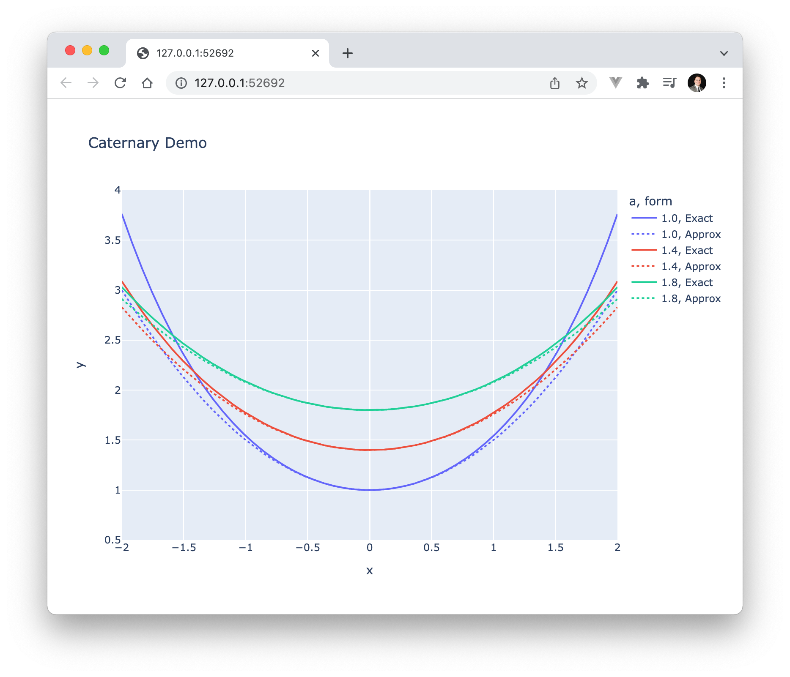

# Poetry: a yarn-like package manager for Python


Photo from Dahiana Waszaj on Upsplash

In this tutorial, we will create a Python package called `math-demo` using the `poetry` Python package manager. We will use `poetry` to scaffold out the `math-demo` package, install our dependencies in a `conda` virtual environment, and run scripts for unit testing and making plots.

After completing this tutorial, you will learn how to:

- Install the `poetry` package manager
- Setup a new Python package with `poetry`
- Use `poetry` with `conda` virtual environments
- Run unit tests and other scripts with `poetry`
- And some math!

## Installing the `poetry` package manager

The installation instructions for `poetry` are available [here](https://python-poetry.org/docs/#installation). To install `poetry` on macOS, we run:

```zsh
curl -sSL https://raw.githubusercontent.com/python-poetry/poetry/master/get-poetry.py | python -
```

We can also install `poetry` tab completions to help us remember all subcommands and options from the command line. The instructions for most popular shells are [here](https://python-poetry.org/docs/#enable-tab-completion-for-bash-fish-or-zsh). If you are using [Oh-My-Zsh](https://github.com/ohmyzsh/ohmyzsh), then you'd run:

```zsh
# Only for Oh-My-Zsh
mkdir $ZSH_CUSTOM/plugins/poetry
poetry completions zsh > $ZSH_CUSTOM/plugins/poetry/_poetry
```

Once this is done, we need to add `poetry` to our list of plugins in our `~/.zshrc` file.

After restarting the terminal, running `poetry --version` prints our version of poetry. We now have tab completion listing out possible `poetry` commands as well. It's useful to note that `poetry` is installed globally similar to tools like `conda` and `yarn`.

## Creating our `math-demo` package

Now that we have poetry installed globally, we can use it to scaffold out a new Python package for us:

```zsh
poetry new math-demo
cd math-demo
```

This will build out the basic structure of a Python package in poetry's standard format in the `math-demo` folder. We should find a subfolder named `math_demo` which, similar to other Python packages, is where our source code will go. There should also be a `tests` folder for unit tests and a curious new `pyproject.toml` file at the top-level.

Historically, Python packages would have a `setup.py` file and optionally a `requirements.txt` file which can be used to install the Python package locally. Instead of writing the code to install the Python package, our `pyproject.toml` file is just a file with data in it that declares information about the Python package in a standard way.

If you are familiar with the `package.json` in web-development, the `pyproject.toml` file is very similar. A `package.json` specifies package dependencies, development dependencies, and scripts for running tests and creating minified builds. Some rough analogies between Python and Javascript would  be:

- `poetry` = `yarn` / `npm`
- `pyproject.toml` = `package.json`
- `poetry.lock` = `yarn.lock` / `package-lock.json`

If we open up the `pyproject.toml` file, we can see that package dependencies and development-only dependencies go under `[tool.poetry.dependencies]` and `[tool.poetry.dev-dependencies]`, respectively.

### But what about `conda`?

If you are familiar with `conda`, then you might think the `pyproject.toml` file is equivalent to an `environment.yaml` file. The `environment.yaml` file was created specifically for recreating consistent runtime environments across machines, whereas the `pyproject.toml` file was first introduced in [PEP 518](https://www.python.org/dev/peps/pep-0518/) as a way to move Python builds to a community standard. Both of these tools have merits, and they are not mutually exclusive.

Here, we will use `conda` to handle our virtual environment as we normally would, and then `poetry` will be our main package manager for dependences within that environment. This has the added benefit of having your IDE automatically recognize your new virutal environment if you already have `conda` setup.

Let's start by adding a bare-bones `environment.yaml` next to our `pyproject.toml`.

```yaml
# environment.yaml
name: math-demo

channels:
  - default
  - conda-forge

dependencies:
  - python=3.8
```

Running `conda env create -f environment.yaml` will then create the `math-demo` virtual environment. We can then activate it in your IDE or by running `conda activate math-demo`.

Now that we have our virtual environment setup, we can use `poetry` to add our dependencies to it. As mentioned in the [documentation](https://python-poetry.org/docs/managing-environments/), `poetry` can manage environments itself, but it will also take your lead as to which environment it should use. That's why this works with the active `conda` environment.

## Installing our dependencies

First of all, let's double-check that we are in the correct environment before installing anything:

```zsh
poetry env info

# => Virtualenv
# => Path:  /Users/{username}/anaconda3/envs/math-demo
```

From the path, we can see that `poetry` is using the correct virtual environment. Let's add plotly, numpy, and pandas so we can do some math!

```zsh
poetry add plotly numpy pandas
```

> **Note:** If you are using VSCode on macOS and do not want to use `conda` for virtual environments, you can go into your settings and add `Library/Caches/pypoetry/virtualenvs` to your `Python: Venv Folders`. This will allow you to select the correct Python interpreter and, importantly, let VSCode find the packages you have just installed for linting.

## Catenary curves and their parabolic approximations

Think of a power line hanging between two telephone poles. What shape does the hanging wire make? It kinda looks like a really wide parabola. It turns out that shape is called a *catenary*. It can be derived using calculus of variations after the simple observation that the curve minimizes the total gravitational potential energy along its arc length. That is, if we were to make a small variation in the way the wire was hanging, it would settle back down to the catenary eventually. You can try this out with string; don't touch power lines.

The formula for a catenary curve centered at `x = 0` is given by:

$$
f(x) = a \cosh(\frac{x}{a})
$$


where `a` is a constant.

Since we are curious how closely a parabola approximates this curve, we can write the second-order Maclaurin series for it.

$$
\begin{align}
    g(x) &= f(0) + f'(0) \cdot x + f''(0) / 2 \cdot x^2 \\
    g(x) &= a \cosh(0) + \sinh(0) \cdot x + \frac{1}{2a} \cosh(0) \cdot x^2 \\
    g(x) &= a + \frac{x^2}{2a}
\end{align}
$$


Aren't you excited to plot these equations?! Or are the power lines looking pretty good right now?

## Implementing the exact and approximate catenary calculations

Next, we are going to add code to calculate $f(x)$ and $g(x)$ to our `math-demo` package.

### Writing a failing test

First we can write a test knowing that the curve should be symmetric about the y-axis (since it is centered at $x = 0$). To do this, start by making a new Python module called `hyperbolic.py` inside `math_demo` next to `__init__.py`.

Let's write the function we want to test and start with something that will definitely fail our symmetry test:

```python
# in hyperbolic.py
def catenary(x):
    return x
```

Great, now let's change our test suite to use this:

```python
# in test_math_demo.py
from math_demo import hyperbolic
import numpy as np

N_POINTS = 10

def test_catenary_symmetric():
    x = np.asarray([2 ** i for i in range(N_POINTS)])
    assert np.all(hyperbolic.catenary(x) == hyperbolic.catenary(-x))
```

Here, we are asserting that $f(x) = f(-x)$ for 10 choices of $x$. Running `poetry run pytest` should show this test fails as expected.

### Making the tests pass

Now we can work on making our test pass. Adding the exact catenary formula, we get:

```python
# in hyperbolic.py
import numpy as np

def catenary(x, a = 1):
    return a * np.cosh(x / a)
```

Now running `poetry run pytest` shows that our symmetry test passes!

### Adding a parabolic approximation

Below the `catenary` function, let's add our parabolic approximation in a new function called `catenary_approx`.

```python
# in hyperbolic.py
def catenary_approx(x, a = 1):
    return a + x ** 2 / (2 * a)
```

Now we are ready to see how well our approximation does for various values of $a$.

## Visualizing exact and approximate catenary curves

We can use plotly to visualize the exact and approximate catenary curves. We can add a `main` function to `hyperbolic.py` and only run it if the module is executed directly (as opposed to imported).

```python
# in hyperbolic.py
def main():
    import plotly.express as px
    import pandas as pd

    x = np.linspace(-2, 2)
    a = [1, 1.4, 1.8]

    df = pd.DataFrame()

if __name__ == "__main__":
    main()
```

Next, we need to build a long-form DataFrame with all $(x, y)$ coordinates, line group, color, and line style labels. We will color curves by the value of the $a$ parameter and make our approximations dashed lines.

```python
# in hyperbolic.py
def main():
    from itertools import cycle
    import plotly.express as px
    import pandas as pd

    x = np.linspace(-2, 2)
    a = [1, 1.4, 1.8]

    df = pd.DataFrame()
    cols = [f"${func}_{{{ai:0.1f}}}$" for func in ["f", "g"] for ai in a]
    for col, ai in zip(cols, cycle(a)):
        df2 = pd.DataFrame({"x": x})
        df2["y"] = caternary(x, ai) if "f" in col else caternary_approx(x, ai)
        df2["line"] = col
        df2["a"] = ai
        df2["form"] = "Exact" if "f" in col else "Approx"
        df = pd.concat([df, df2])

    fig = px.line(
        df,
        x="x",
        y="y",
        line_group="line",
        color="a",
        line_dash="form",
        title="Catenary Demo",
    )
    fig.update_yaxes(range=[0.5, 4])
    fig.show()

if __name__ == "__main__":
    main()
```

To see the results, we can run:

```bash
poetry run python math_demo/hyperbolic.py
```



This will open the plot in your browser to show our catenary curves and decent parabolic approximations to them.

## Final thoughts

In this tutorial, we learned how to `install` and use the `poetry` package manager to make a new Python package. We separated our `pytest` development dependencies from our package dependencies using the `pyproject.toml` file. We were also still able to still use a `conda` virtual environment with `poetry`.

We also did a little bit of math about catenary curves! If you want to see the details of how the exact catenary formula can be derived, [here](http://galileoandeinstein.phys.virginia.edu/7010/CM_02_CalculusVariations.html) is a post from the University of Virginia.

## Source availability

All source materials for this article are available [here](https://github.com/jmswaney/blog/tree/main/04_poetry_quickstart) on my blog GitHub repo.
