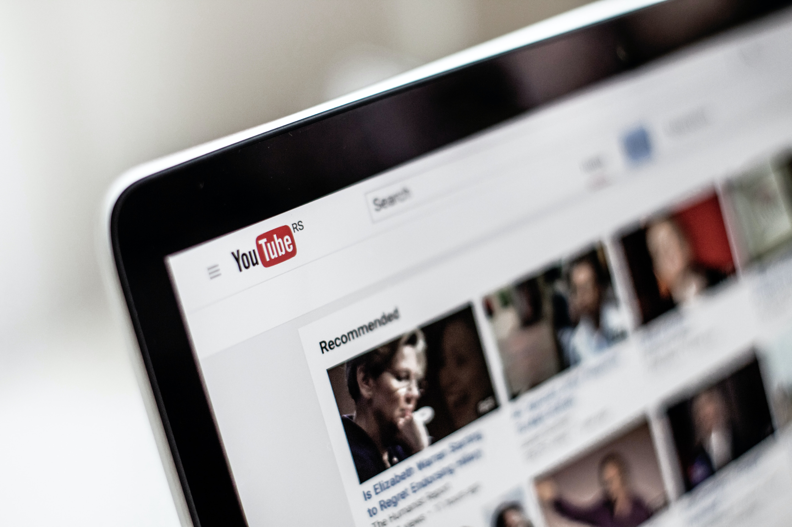

# Downloading audio, video, and thumbnails from YouTube


> Photo by *NordWood Themes* on Unsplash.

**Disclaimer:** This article does **not** condone any illegitimate use of
`youtube-dl` to access copyrighted works. The author takes no responsibility for
how others use the `youtube-dl` software.

## What is youtube-dl?

The [youtube-dl](https://github.com/ytdl-org/youtube-dl) project provides a
command-line interface (CLI) for easily downloading multimedia files from
YouTube and other video sites. The project is released under the
[Unlicense](https://choosealicense.com/licenses/unlicense/) license, meaning
that the software has been released into the public domain without warranty or
assuming any liability.

## Setting up youtube-dl

If you're on a Mac or Linux box, the setup is just a matter of downloading a
build and making it executable:

```bash
$ sudo curl -L https://yt-dl.org/downloads/latest/youtube-dl -o /usr/local/bin/youtube-dl
$ sudo chmod a+rx /usr/local/bin/youtube-dl
```

## Downloading a single video

The `youtube-dl` CLI has a plethora of optional arguments, but a URL is the only
required argument. Let's try downloading a video by grabbing a URL from YouTube.

```bash
$ youtube-dl youtube.com/watch?v=dQw4w9WgXcQ

[youtube] dQw4w9WgXcQ: Downloading webpage
[youtube] dQw4w9WgXcQ: Downloading player 4fe52f49
WARNING: Requested formats are incompatible for merge and will be merged into mkv.
[download] Destination: Rick Astley - Never Gonna Give You Up (Video)-dQw4w9WgXcQ.f137.mp4
[download] 100% of 107.63MiB in 00:13
[download] Destination: Rick Astley - Never Gonna Give You Up (Video)-dQw4w9WgXcQ.f251.webm
[download] 100% of 3.28MiB in 00:00
[ffmpeg] Merging formats into "Rick Astley - Never Gonna Give You Up (Video)-dQw4w9WgXcQ.mkv"
Deleting original file Rick Astley - Never Gonna Give You Up (Video)-dQw4w9WgXcQ.f137.mp4 (pass -k to keep)
Deleting original file Rick Astley - Never Gonna Give You Up (Video)-dQw4w9WgXcQ.f251.webm (pass -k to keep)

$ ls

'Rick Astley - Never Gonna Give You Up (Video)-dQw4w9WgXcQ.mkv'
```

As you can see, we nearly just got Rick-rolled. In the logs, we can see that
`youtube-dl` will merge requested formats with `ffmpeg` into a single `mkv`
file. 

## Downloading audio, video, and a thumbnail

Let's see if we can keep the individual parts and also get a thumbnail.

```bash
$ rm "Rick Astley - Never Gonna Give You Up (Video)-dQw4w9WgXcQ.mkv"
$ youtube-dl https://www.youtube.com/watch\?v\=dQw4w9WgXcQ --write-thumbnail -k

[youtube] dQw4w9WgXcQ: Downloading webpage
[youtube] dQw4w9WgXcQ: Downloading thumbnail ...
[youtube] dQw4w9WgXcQ: Writing thumbnail to: Rick Astley - Never Gonna Give You Up (Video)-dQw4w9WgXcQ.webp
WARNING: Requested formats are incompatible for merge and will be merged into mkv.
[download] Destination: Rick Astley - Never Gonna Give You Up (Video)-dQw4w9WgXcQ.f137.mp4
[download] 100% of 107.63MiB in 00:12
[download] Destination: Rick Astley - Never Gonna Give You Up (Video)-dQw4w9WgXcQ.f251.webm
[download] 100% of 3.28MiB in 00:00
[ffmpeg] Merging formats into "Rick Astley - Never Gonna Give You Up (Video)-dQw4w9WgXcQ.mkv"

$ ls

'Rick Astley - Never Gonna Give You Up (Video)-dQw4w9WgXcQ.f137.mp4'
'Rick Astley - Never Gonna Give You Up (Video)-dQw4w9WgXcQ.f251.webm'
'Rick Astley - Never Gonna Give You Up (Video)-dQw4w9WgXcQ.mkv'
'Rick Astley - Never Gonna Give You Up (Video)-dQw4w9WgXcQ.webp'
```

Here, the `-k` flag keeps the files that is combined into the previous `.mkv`
file, and the `--write-thumbnail` flag fetches the video thumbnail. 

> Note: `youtube-dl` checks if the target files are already downloaded (cached)
> before re-downloading them, which is why we deleted the original `.mkv` file
> first.

Now we have 4 files:

1. **mp4** - This is an MP4 container with a video stream and no audio stream
2. **webm** - This is a web-friendly audio format with the sound
3. **mkv** - This is a Matroska container with both the video and audio streams
4. **webp** - This is a web-friendly image format with the thumbnail image

## Setting up a config file for youtube-dl

Given the number of optional command line options available in `youtube-dl`, we
can also setup a config file so that we don't have to keep typing the settings
we'd like to use.

```bash
$ cd
$ mkdir .config/youtube-dl
$ nano .config/youtube-dl/config

# Inside ~/.config/youtube-dl/config
# Always extract audio
-x

$ youtube-dl youtube.com/watch?v=dQw4w9WgXcQ

[youtube] dQw4w9WgXcQ: Downloading webpage
[download] Destination: Rick Astley - Never Gonna Give You Up (Video)-dQw4w9WgXcQ.webm
[download] 100% of 3.28MiB in 00:00
[ffmpeg] Destination: Rick Astley - Never Gonna Give You Up (Video)-dQw4w9WgXcQ.opus
Deleting original file Rick Astley - Never Gonna Give You Up (Video)-dQw4w9WgXcQ.webm (pass -k to keep)

$ ls

'Rick Astley - Never Gonna Give You Up (Video)-dQw4w9WgXcQ.opus'
```

Now when we re-run the first `youtube-dl` command, we get a `.opus` audio file.
This happened because `youtube-dl` found our config file for the current user,
which applied the `-x` flag to convert the video to an audio-only file.

## Final thoughts

There are many more features and customization options avaible for `youtube-dl`,
which you can look through on the project's
[README](https://github.com/ytdl-org/youtube-dl/blob/master/README.md#options).
For example, you can specify a proxy URL, download playlists, apply regex
filters to video titles, and much more.
